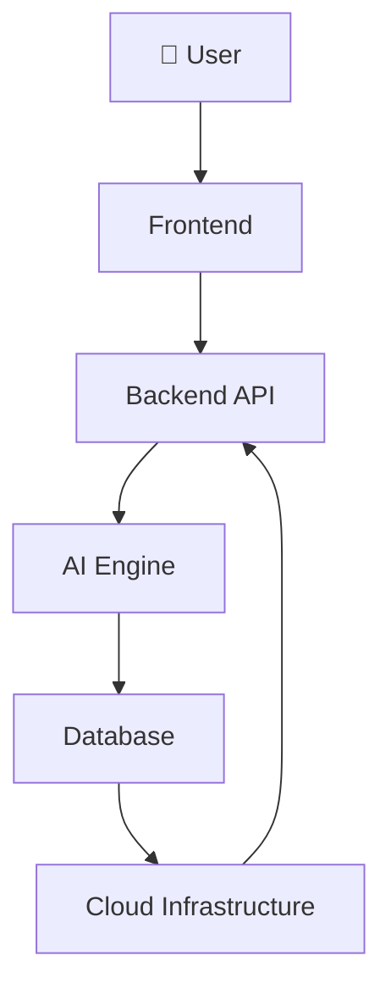
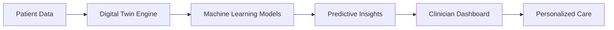

<!-- ============================================================
     VENKAT THOSHISH KRISHNA — Personal AI Operating System
     
     ============================================================ -->

  

<!-- ── EYEBROW / TYPEOGRAPHY ── -->

  WELCOME TO YOUR FUTURE

<!-- ── NAME ── -->
<h1 style="font-family: -apple-system, BlinkMacSystemFont, 'Segoe UI', sans-serif;
           font-weight: 700; font-size: 52px; line-height: 1.1;
           letter-spacing: -1px; color: #FFFFFF; margin: 24px 0 8px;">
  VENKAT THOSHISH KRISHNA
</h1>

<!-- ── ROLE ── -->

  AI Engineer&nbsp;&nbsp;·&nbsp;&nbsp;Full Stack Developer&nbsp;&nbsp;·&nbsp;&nbsp;Digital Twin Researcher

  

<!-- ── BADGE ROW ── -->

  &nbsp;&nbsp;
  &nbsp;&nbsp;
  

 

<!-- ══════════════════════════════════════════════════════════
     AI HOLOGRAPHIC IDENTITY HERO
══════════════════════════════════════════════════════════════ -->
<section style="max-width: 1000px; margin: 0 auto; padding: 40px 0;">

  <!-- Holographic profile avatar -->
  

    
  

    

  <!-- Identity title -->
  <h1 align="center" style="font-family: -apple-system, BlinkMacSystemFont, 'Segoe UI', sans-serif; font-weight: 700; font-size: 46px; line-height: 1.15; letter-spacing: 1px; color: #FFFFFF; margin: 0;">
    VENKAT THOSHISH KRISHNA
  </h1>

   

  <!-- Animated role lines -->
  

    AI ENGINEER 
    DIGITAL TWIN ARCHITECT 
    FUTURE TECHNOLOGY BUILDER
  

    

  <!-- Status / Core readouts -->
  

    

      
SYSTEM

      
● ONLINE

    

    

      
CORE

      
ARTIFICIAL INTELLIGENCE

    

  

    

  <!-- Identity showcase row -->
  

    
    
    
  

  

    AI CORE · HOLOGRAM SCAN · IDENTITY FRAME
  

</section>

  

<!-- ══════════════════════════════════════════════════════════
     01 · CINEMATIC HERO
══════════════════════════════════════════════════════════════ -->
<section style="max-width: 1000px; margin: 0 auto; padding: 40px 0;">
  

    
  

</section>

  

<!-- ══════════════════════════════════════════════════════════
     02 · SYSTEM BOOT
══════════════════════════════════════════════════════════════ -->
<section style="max-width: 1000px; margin: 0 auto; padding: 40px 0;">
  
02

  <h2 align="center" style="font-family: -apple-system, sans-serif; font-weight: 600; font-size: 30px; color: #FFFFFF; margin: 8px 0 28px;">System Boot</h2>

  

    
  

</section>

  

<!-- ══════════════════════════════════════════════════════════
     03 · PROFILE
══════════════════════════════════════════════════════════════ -->
<section style="max-width: 1000px; margin: 0 auto; padding: 40px 0;">
  
03

  <h2 align="center" style="font-family: -apple-system, sans-serif; font-weight: 600; font-size: 30px; color: #FFFFFF; margin: 8px 0 28px;">Identity Profile</h2>

  

    
  

   

  <!-- Glass card data -->
  

    <table style="border-collapse: collapse; width: 100%; font-family: -apple-system, sans-serif;">
      <tr><td style="padding: 10px 0; font-size: 12px; letter-spacing: 2px; color: #C0C0C0; width: 140px;">ROLE</td>
          <td style="padding: 10px 0; font-size: 15px; color: #FFFFFF;">Computer Science Engineer</td></tr>
      <tr><td style="padding: 10px 0; font-size: 12px; letter-spacing: 2px; color: #C0C0C0;">EDUCATION</td>
          <td style="padding: 10px 0; font-size: 15px; color: #FFFFFF;">B.Tech — Aditya College of Engineering</td></tr>
      <tr><td style="padding: 10px 0; font-size: 12px; letter-spacing: 2px; color: #C0C0C0;">CORE</td>
          <td style="padding: 10px 0; font-size: 15px; color: #FFFFFF;">AI · Generative AI · Cloud · Digital Twins · Cyber</td></tr>
      <tr><td style="padding: 10px 0; font-size: 12px; letter-spacing: 2px; color: #C0C0C0;">MISSION</td>
          <td style="padding: 10px 0; font-size: 15px; color: #00E5FF;">Building next generation intelligent systems</td></tr>
    </table>
  

</section>

  

<!-- ══════════════════════════════════════════════════════════
     04 · TECHNOLOGY
══════════════════════════════════════════════════════════════ -->
<section style="max-width: 1000px; margin: 0 auto; padding: 40px 0;">
  
04

  <h2 align="center" style="font-family: -apple-system, sans-serif; font-weight: 600; font-size: 30px; color: #FFFFFF; margin: 8px 0 28px;">Technology Engine</h2>

  

    
  

    

  

    
  

</section>

  

<!-- ══════════════════════════════════════════════════════════
     05 · PROJECTS
══════════════════════════════════════════════════════════════ -->
<section style="max-width: 1000px; margin: 0 auto; padding: 40px 0;">
  
05

  <h2 align="center" style="font-family: -apple-system, sans-serif; font-weight: 600; font-size: 30px; color: #FFFFFF; margin: 8px 0 28px;">Project Garage</h2>

  

    
  

   

  

    <!-- Flagship -->
    

      
PROJECT 01 · FLAGSHIP

      <h3 style="font-size: 20px; color: #00E5FF; margin: 0 0 6px;">MEDTWIN AI</h3>
      
AI Healthcare Digital Twin Platform

      
▸ Patient Intelligence Passport ▸ AI Health Timeline ▸ Hospital Resource Prediction ▸ Medical AI Assistant

      
<a href="projects/medtwin-ai.md" style="color: #00E5FF; text-decoration: none; font-size: 13px;">Read the brief →</a>

    

    <!-- Genesis -->
    

      
PROJECT 02

      <h3 style="font-size: 20px; color: #FFFFFF; margin: 0 0 6px;">GENESIS PLATFORM</h3>
      
Innovation &amp; Startup Expo Ecosystem

      
▸ Event Management ▸ Registration System ▸ AI Voice Navigation ▸ Admin Dashboard

      
<a href="projects/genesis-platform.md" style="color: #00E5FF; text-decoration: none; font-size: 13px;">Read the brief →</a>

    

    <!-- AI Lab -->
    

      
PROJECT 03

      <h3 style="font-size: 20px; color: #C0C0C0; margin: 0 0 6px;">AI LAB</h3>
      
Artificial Intelligence Experiments

      
▸ Generative AI Prototypes ▸ ML Experimentation ▸ Automation Pipelines ▸ Research Sandbox

      
<a href="projects/ai-lab.md" style="color: #00E5FF; text-decoration: none; font-size: 13px;">Read the brief →</a>

    

  

</section>

  

<!-- ══════════════════════════════════════════════════════════
     06 · ARCHITECTURE
══════════════════════════════════════════════════════════════ -->
<section style="max-width: 1000px; margin: 0 auto; padding: 40px 0;">
  
06

  <h2 align="center" style="font-family: -apple-system, sans-serif; font-weight: 600; font-size: 30px; color: #FFFFFF; margin: 8px 0 28px;">System Architecture</h2>

  

    
  

   

  

    
AI SYSTEM ARCHITECTURE

  

   

  

    
DIGITAL TWIN DATA FLOW

  

</section>

  

<!-- ══════════════════════════════════════════════════════════
     07 · TIMELINE
══════════════════════════════════════════════════════════════ -->
<section style="max-width: 1000px; margin: 0 auto; padding: 40px 0;">
  
07

  <h2 align="center" style="font-family: -apple-system, sans-serif; font-weight: 600; font-size: 30px; color: #FFFFFF; margin: 8px 0 28px;">Research &amp; Innovation</h2>

  

    
  

</section>

  

<!-- ══════════════════════════════════════════════════════════
     08 · ANALYTICS
══════════════════════════════════════════════════════════════ -->
<section style="max-width: 1000px; margin: 0 auto; padding: 40px 0;">
  
08

  <h2 align="center" style="font-family: -apple-system, sans-serif; font-weight: 600; font-size: 30px; color: #FFFFFF; margin: 8px 0 28px;">Mission Analytics</h2>

  

    
    &nbsp;
    
  

   

  

    
  

   

  

    
  

</section>

  

<!-- ══════════════════════════════════════════════════════════
     09 · SNAKE
══════════════════════════════════════════════════════════════ -->
<section style="max-width: 1000px; margin: 0 auto; padding: 40px 0;">
  
09

  <h2 align="center" style="font-family: -apple-system, sans-serif; font-weight: 600; font-size: 30px; color: #FFFFFF; margin: 8px 0 28px;">Contribution Engine</h2>

  

    
  

  
Auto-generated by GitHub Actions every 6 hours

</section>

  

<!-- ══════════════════════════════════════════════════════════
     10 · CONNECT
══════════════════════════════════════════════════════════════ -->
<section style="max-width: 1000px; margin: 0 auto; padding: 40px 0;">
  
10

  <h2 align="center" style="font-family: -apple-system, sans-serif; font-weight: 600; font-size: 30px; color: #FFFFFF; margin: 8px 0 28px;">Connect</h2>

  

    &nbsp;&nbsp;
    
  

</section>

  

<!-- ══════════════════════════════════════════════════════════
     11 · FOOTER
══════════════════════════════════════════════════════════════ -->
<section style="max-width: 1000px; margin: 0 auto; padding: 60px 0 40px;">
  

    “Engineering Tomorrow's Intelligence”
  

   
  

    
  

   
  

    © 2026 VENKAT THOSHISH KRISHNA &nbsp;·&nbsp; PERSONAL AI OPERATING SYSTEM
  

</section>

  

